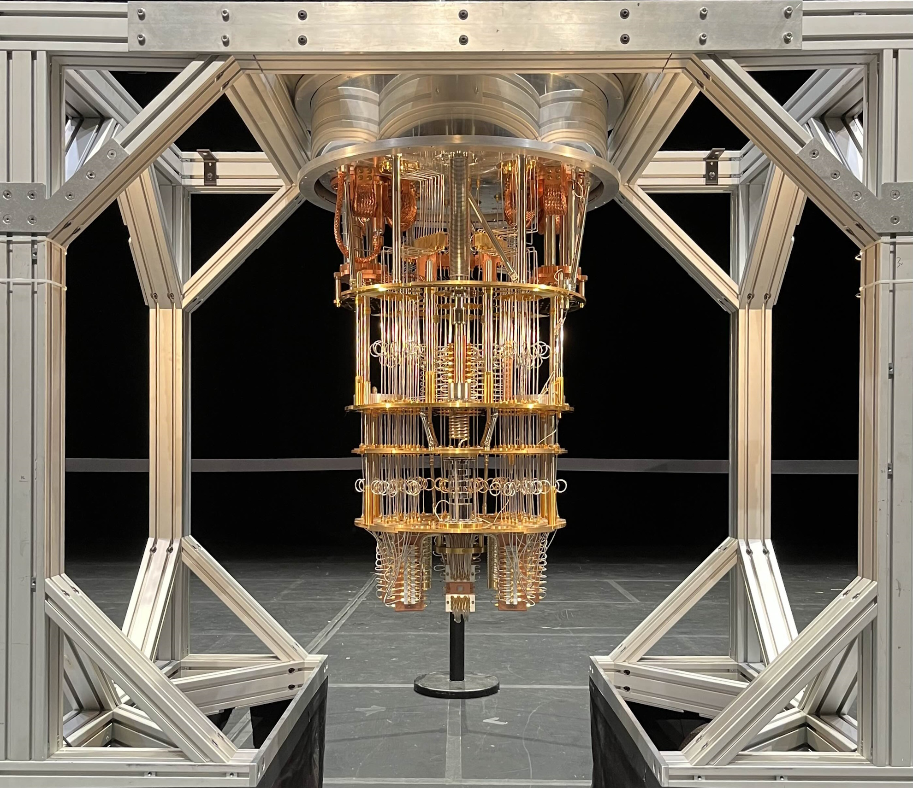

.. CSCI4961_labs_projects documentation master file, created by
   sphinx-quickstart on Wed Dec 11 22:26:35 2024.
   You can adapt this file completely to your liking, but it should at least
   contain the root `toctree` directive.

Welcome to Quantum Education Modules!
=====================================

.. toctree::
    :maxdepth: 1
    :hidden:

    Home <self>

.. toctree::
   :maxdepth: 2
   :caption: User Documentation

   user/introduction
   user/roadmap
   user/usage
   user/contribute

.. toctree::
   :maxdepth: 2
   :caption: Introductory Modules

   introductory/qubits/index
   introductory/gates/index
   introductory/circuits/index
   
.. toctree::
   :maxdepth: 2
   :caption: Intermediate Modules

   intermediate/placeholder

.. toctree::
   :maxdepth: 2
   :caption: Advanced Modules

   advanced/quantum_sensing/index

.. toctree::
   :maxdepth: 2
   :caption: Quantum Circuit Design

   quantum_circuit_design/introduction